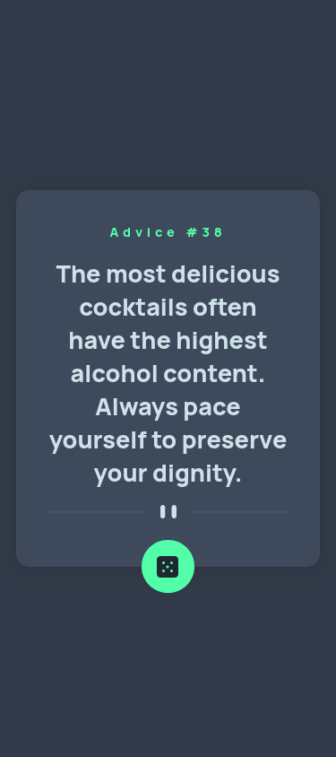
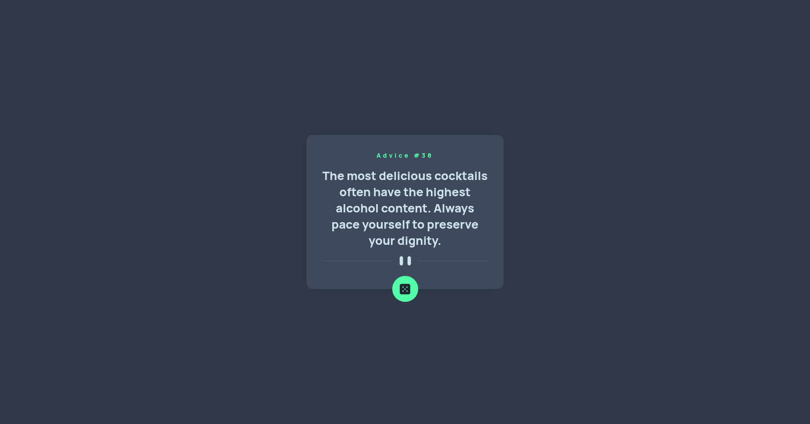

# Frontend Mentor - Advice generator app solution

This is a solution to the [Advice generator app challenge on Frontend Mentor](https://www.frontendmentor.io/challenges/advice-generator-app-QdUG-13db). Frontend Mentor challenges help you improve your coding skills by building realistic projects.

## Table of contents

- [Overview](#overview)
  - [Screenshot](#screenshot)
  - [Links](#links)
- [My process](#my-process)
  - [Built with](#built-with)
- [Author](#author)

## Overview

### Screenshot

- Mobile: 

- Desktop:

### Links

- [Solution URL](https://github.com/fborlido/fm-advice)
- [Live Site URL](https://fborlido.github.io/fm-advice)

## My process

### Built with

- ReactJS
- Axios
- Sass
- Vite

## Author

- Website - [Fred Borlido](https://github.com/fborlido)
- Frontend Mentor - [@fborlido](https://www.frontendmentor.io/profile/fborlido)
